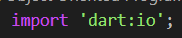
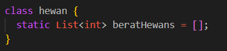
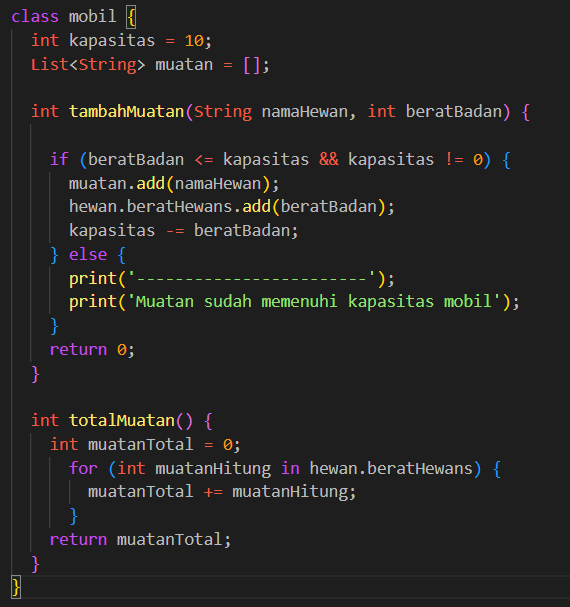
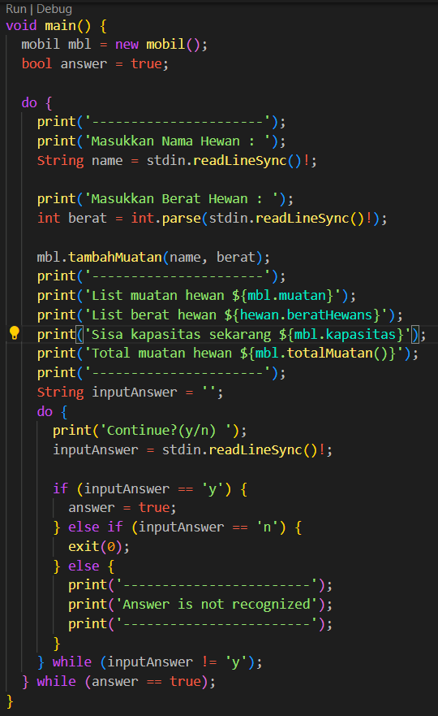
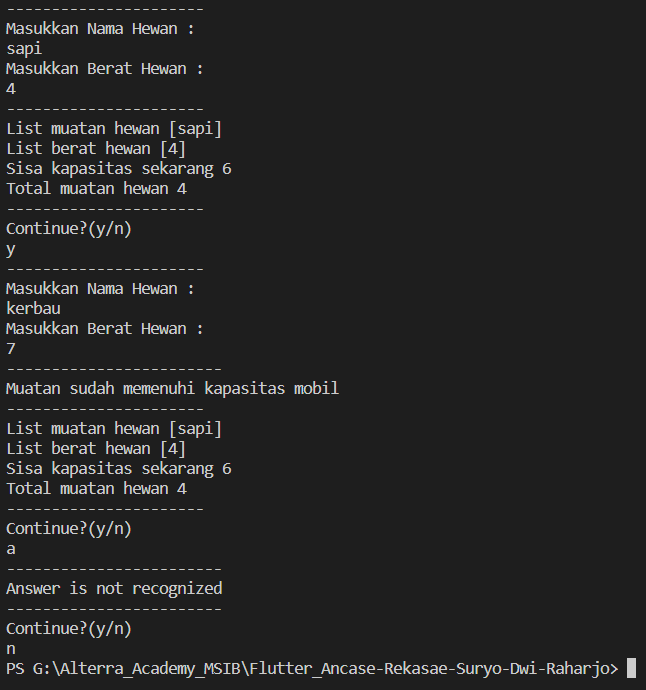

# Section 10 : Collection

## Data Diri

> Nomor Urut  : 1_007fFLC_0  
Nama        : Ancase Rekasae Suryo Dwi Raharjo

--- 

 

## Task

>Pada Task section 10 ini saya menggunakan konsep user input untuk memasukkan nilai data di dalam property class nanti. Selain itu, saya juga menggunakan perulangan nested Do While di fungsi main untuk membuat nya seperti program akan terus berjalan jika tidak di exit.

Untuk lebih jelas nya berikut ada beberapa screenshot per bagian yang saya rasa bisa menjelaskan code program yang saya buat :

1. Pertama-tama mengimport untuk input/output dengan code `dart:io`, akan terlihat seperti berikut :

2. Membuat Class Hewan yang berisi **property untuk menampung nilai berat hewan**, seperti berikut :

3. Membuat Class Mobil yang berisi **2 property dan 2 method**, seperti berikut :

Property pertama adalah property integer yang menyimpan kapasitas maksimal mobil, property kedua adalah property List untuk menyimpan nama hewan.

Kemudian method pertama merupakan method untuk memasukkan nilai input dari terminal kedalam property List yang ada di Class hewan dan List yang ada di Class mobil, juga mengurangi kapasitas dengan berat hewan yang di inputkan.

Di dalam nya menggunakan IF-ELSE untuk menentukan 2 kondisi yaitu jika berat hewan kurang sama dengan kapasitas dan kapasitas tidak nol atau telah penuh, sedangkan kondisi satu lagi jika kapasitas sudah penuh.

Method kedua adalah method untuk menghitung total muatan yang sudah di inputkan oleh user selama belum exit, untuk perhitungannya menggunakan perulangan For

4. Terakhir membuat fungsi main

Pada Fungsi main ini ada **2 bagian** yaitu bagian untuk mendeklarasikan variabel pemanggil property dan method pada class mobil tadi dan variabel `bool` untuk inisiasi infinite looping.

Bagian selanjutnya adalah bagian nested `Do-While` untuk mengulang-mengulang input nama dan berat hewan sekaligus nested `Do-While` juga mengulang-mengulang pertanyaan **"Continue?"** yang bermaksut ingin lanjut mengisi atau tidak dan jika input selain y/n maka akan kembali mengulang ke **"Continue?"**

Untuk hasil code program diatas akan seperti berikut :

