# Section 11 : Dart Object Oriented Programming 2

## Data Diri

> Nomor Urut  : 1_007fFLC_0  
Nama        : Ancase Rekasae Suryo Dwi Raharjo

--- 

 

## Task

> Pada Section 11 dengan judul Dart Object Oriented Programming 2 ini terdapat 2 task sebenarnya tapi dibuat 4 perintah yang menunjukkan poin-poin yang harus dikerjakan seperti :

### **Task 1**

>Task 1 ini terdapat 2 poin yang harus ada, yaitu :
>- Membuat class BangunRuang dengan isi property panjang, lebar, tinggi dan method volume. Lalu class Kubus dengan isi property sisi. Kemudian class kosong bernama Balok.
>- Lakukan method overriding untuk membedakan tiap proses dalam method antar class

Dalam pengerjaan task 1 saya memakai konsep memasukkan bilangan panjang,lebar, tinggi di fungsi main. Kemudian volume balok akan dihitung pada class BangunRuang dan untuk volume kubus akan dihitung pada class Kubus dengan meng-override method volume. Berikut langkah-langkahnya :

1. Mengimport dart io untuk fungsi pengambilan inputan user di terminal

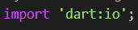

2. Membuat class BangunRuang dengan method volume berisi property panjang, lebar, tinggi yang menyimpan nilai parameter

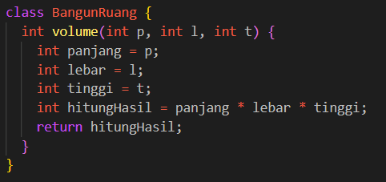

3. Membuat class Kubus yang terdapat method volume yang di overriding dan berisi property sisi

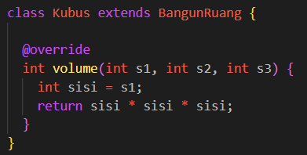

4. Membuat class Balok yang terdapat method volume yang di overriding return nilai method volume pada parent

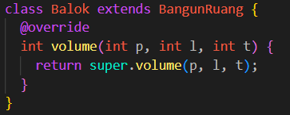

5. Membuat object class-class tadi untuk memanggil nya dan membuat tempat input user

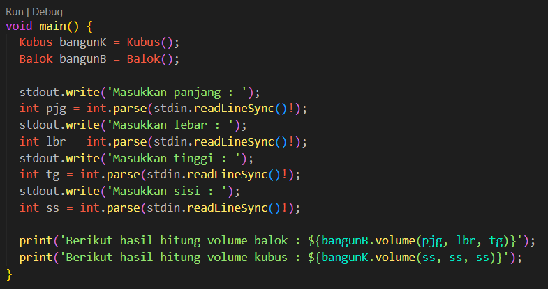

6. Hasil run code task 1

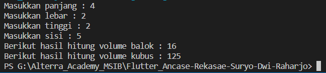

### **Task 2**

>Sama seperti task 1, pada task 2 ini terdapat 2 poin yang harus ada pada code. Dua poin tersebut adalah sebagai berikut :
>- Membuat class Matematika dengan isi method hasil. Lalu class KelipatanPersekutuanTerkecil dengan isi property x dan y. Kemudian class bernama FaktorPersekutuanTerbesar berisi sama yaitu property x dan y.
>- Lengkapilah proses KPK dan FPB tersebut agar menghasilkan output yang benar

Dalam pengerjaan task 2 ini saya juga sama memakai konsep memasukkan bilangan pertama dan kedua di fungsi main. Kemudian untuk menghitung KPK dan FPB ada di class masing-masing dengan meng-override method hasil yang ada di parent. Berikut langkah-langkahnya :

1. Mengimport dart io untuk input user

2. Membuat class Matematika dengan isi method hasil yang ada parameter nya

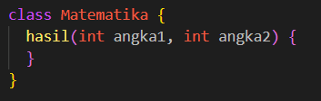

3. Membuat class FPB yang berisi property x dan y dan method hasil yang di override menjadi arrow function berisi fungsi untuk menghitung FPB yaitu gcd

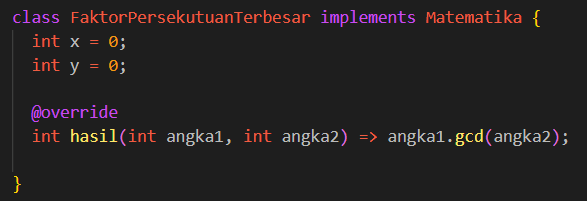

4. membuat class KPK yang berisi property x dan y dan method hasil yang di override menjadi arrow function berisi proses untuk menghitung KPK namun disini ada 2 cara proses menghitung nya jadi saya membuat method lagi untuk assest saya juga ada method fpb yang digunakan untuk keperluan menghitung di proses KPK

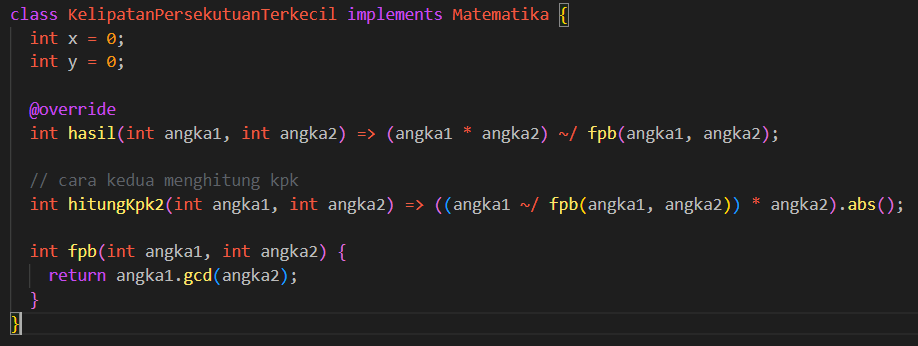

5. Membuat object class FPB dan KPK untuk memanggil nya dan tempat input user lalu dimasukkan kedalam method hasil di class masing-masing

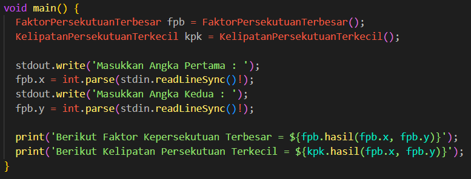

6. Hasil run code task 2

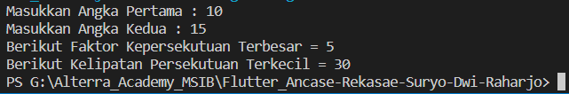

---
