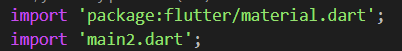
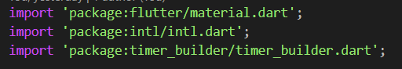
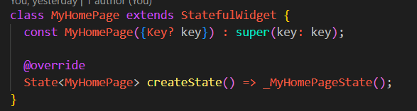
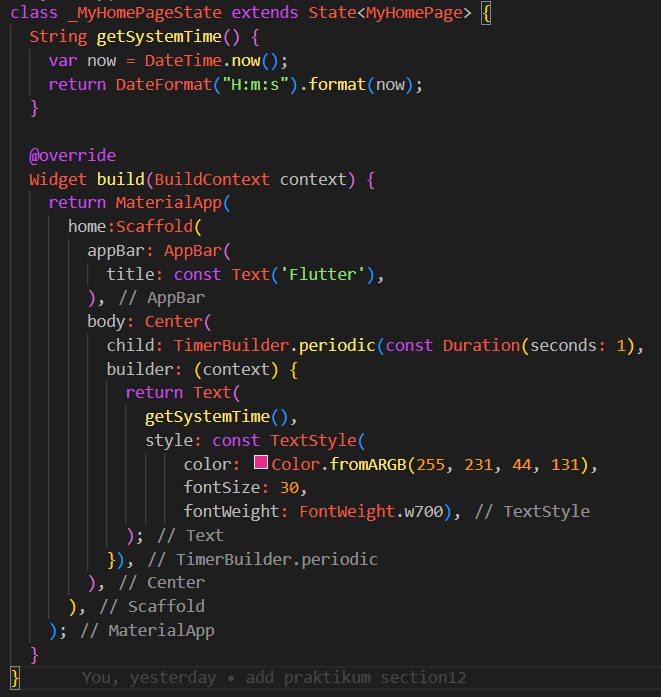
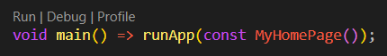

# Section 12 : Introduction Flutter Widget

## Data Diri

> Nomor Urut  : 1_007fFLC_0  
Nama        : Ancase Rekasae Suryo Dwi Raharjo

--- 

 

## Task

>Pengerjaan task section 12 ini saya menggunakan library intl dan timerbuilder untuk membuat teks berubah-ubah seperti jam.

Pertam-tama dalam pengerjaan membuat 2 file bernama `main.dart` dan `main2.dart` yang nantinya untuk menyelesaikan perintah kedua dari task yaitu memisahkan widget agar lebih rapi.

1. Mengimport MaterialApp dan file main2.dart di main.dart

2. Pada main2.dart mengimport library MaterialApp, intl, dan timer_builder

3. Membuat widget turunan statefulwidget sesuai perintah task bernama MyHomePage dan di isi constructor key juga method create state

4. Membuat turunan state MyHomePage agar logika pembuatan teks berubah-ubah bisa dipanggil
   
   
   
   Di dalam turunan state MyHomePage ini terdapat method getSystemTime yang berisi fungsi `DateTime.now()` yang berguna untuk mendapatkan jam waktu sekarang yang lalu diformat menampilkan jam saja dengan `DateFormat(...)` dari library intl.
   
   Kemudian terdapat widget build yang berguna untuk membuat build tampilan widget. Di widget build terdapat widget MaterialApp, scaffold, Appbar, dan body. Di dalam body terdapat child time periodic agar jam yang didapat tadi bergerak secara dinamic sesuai waktu yang merupakan bagian dari library timer_builder. Lalu method `getSystemTime()` dibungkus dengan text dan custom setting nya.

5. Terakhir tinggal memanggil fungsi MyHomePage di fungsi main pada file main.dart

