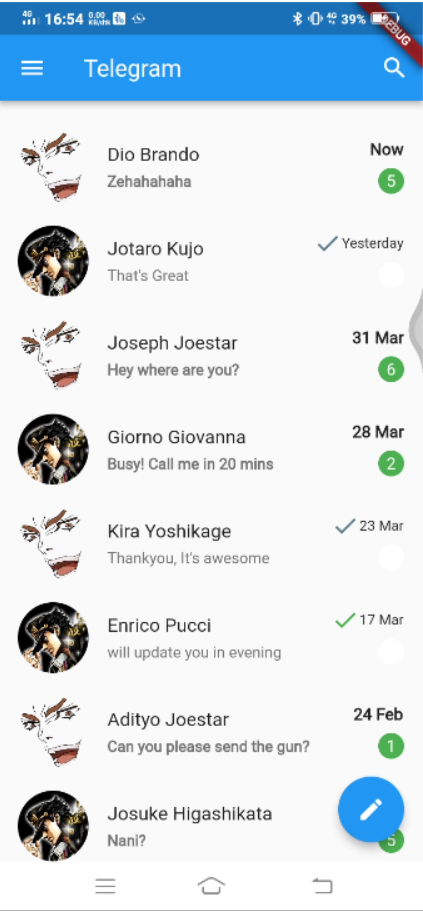
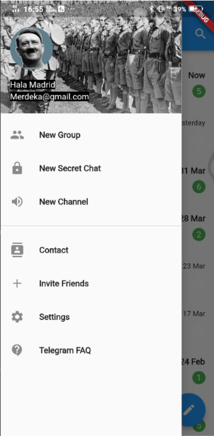
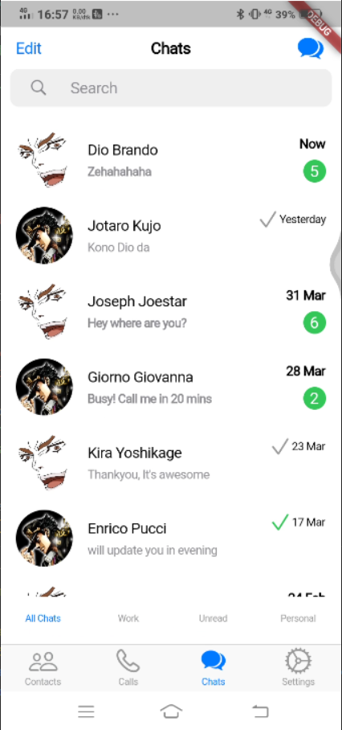

# Section 13 : Platform Widget

## Data Diri

> Nomor Urut  : 1_007fFLC_0  
Nama        : Ancase Rekasae Suryo Dwi Raharjo

--- 

 

## **Task**

>Task section 13 ini saya membuat semirip mungkin dengan contoh gambar karena selain sebagai aset saya juga sebagai self learning untuk mengerjakan mini project dan projek Capstone di masa depan nanti.

Task 1 ini saya membuat tampilan yang mirip dengan telegram yang terdapat chat page dan menu profile. Dan task 2 membuat tampilan chat page saja, berikut adalah output dari task 1 dan task 2:

1. Untuk Task 1 terdapat main.dart, chat_page.dart dan drawer_page.dart di dalam folder material_app

2. Untuk Task 2 terdapa main2.dart, chat_page.dart dan chat_category.dart di dalam folder cupertino_app

