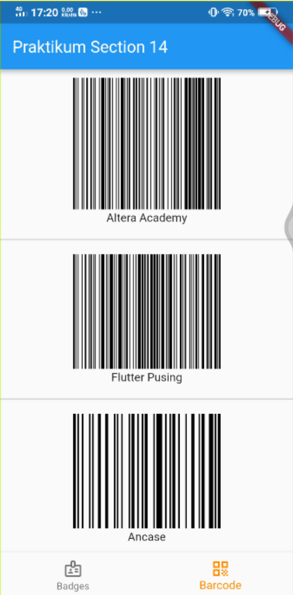

# Section 14 : Platform Widget

## Data Diri

> Nomor Urut  : 1_007fFLC_0  
Nama        : Ancase Rekasae Suryo Dwi Raharjo

--- 

 

## **Task**

>Task section 14 ini saya membuat semirip mungkin dengan contoh gambar karena selain sebagai aset saya juga sebagai self learning untuk mengerjakan mini project dan projek Capstone di masa depan nanti.

Task 1 membuat tampilan badges dan chips, sedangkan task 2 membuat tampilan barcode. Lalu saya menggabungkan task 1 dan task 2 menjadi satu code program dengan  Barikut hasil run code program nya :

1. Untuk output Task 1 

2. Untuk output Task 2 

