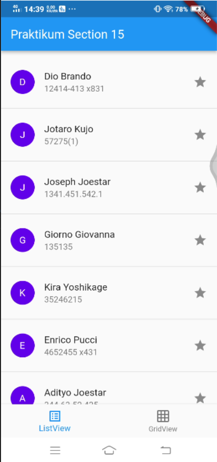
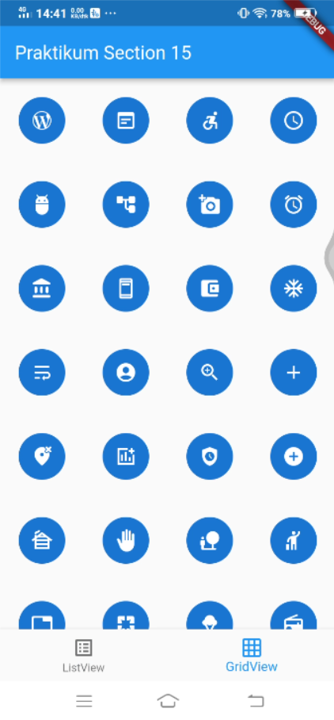

# Section 15 : Flutter Layout

## Data Diri

> Nomor Urut  : 1_007fFLC_0  
Nama        : Ancase Rekasae Suryo Dwi Raharjo

--- 

 

## **Task**

>Task section 15 ini saya membuat semirip mungkin dengan contoh gambar karena selain sebagai aset saya juga sebagai self learning untuk mengerjakan mini project dan projek Capstone di masa depan nanti.

Task 1 membuat tampilan daftar seperti kontak dengan menggunakan ListView, sedangkan task 2 membuat tampilan daftar icon dengan menggunakan GridView. Lalu saya menggabungkan task 1 dan task 2 menjadi satu code program dengan, Berikut hasil run code program nya :

1. Untuk output Task 1 

2. Untuk output Task 2 

