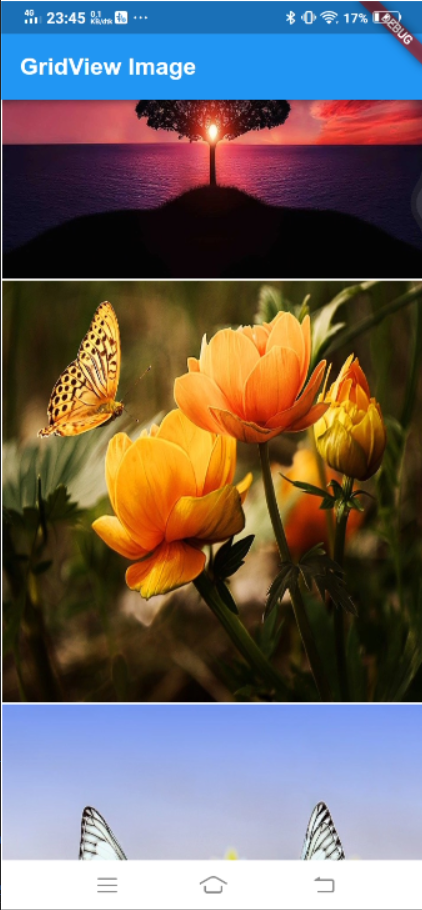
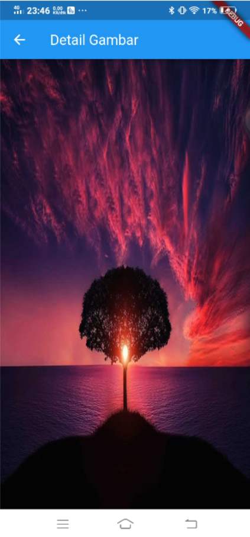

# Section 16 : Assets

## Data Diri

> Nomor Urut  : 1_007fFLC_0  
Nama        : Ancase Rekasae Suryo Dwi Raharjo

--- 

 

## **Task**

>Task section 16 ini saya membuat sesuai pemahaman saya di soal dan selain sebagai aset saya juga sebagai self learning untuk mengerjakan mini project dan projek Capstone di masa depan nanti.

Task pada section 16 ini membuat tampilan GridView image dari internet berjumlah 3. Kemudian ditambahkan fungsionalitas seperti berikut :
- Ketika gambar ditekan, akan terbuka halaman baru
- Halaman tersebut menampilkan gambar yang ditekan
- Gambar ditampilkan memenuhi halaman

Berikut hasil run code program nya :

1. Output Task Section 16 

---