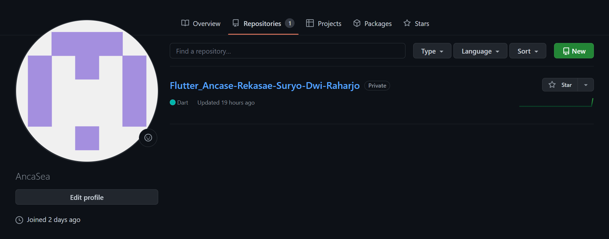
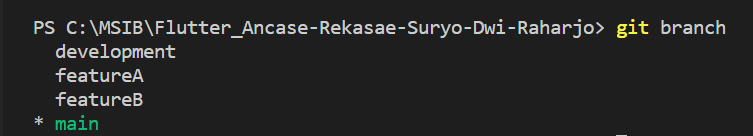
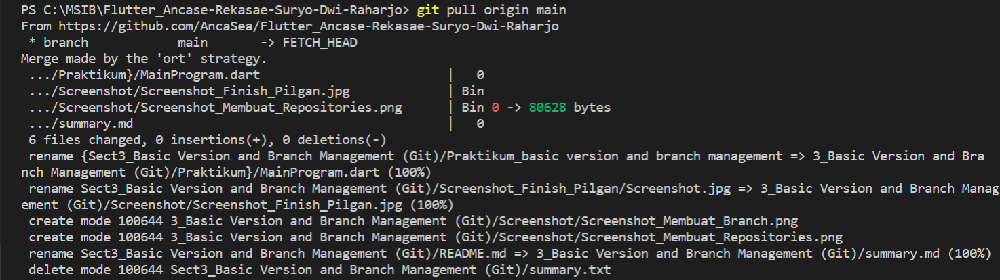
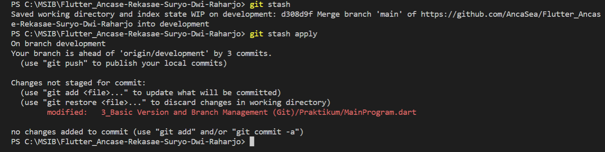
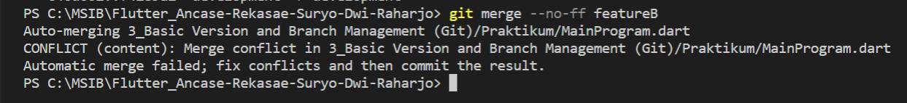
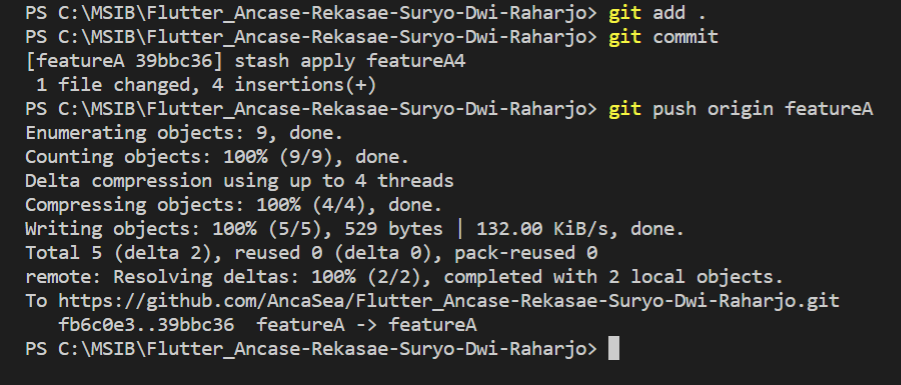
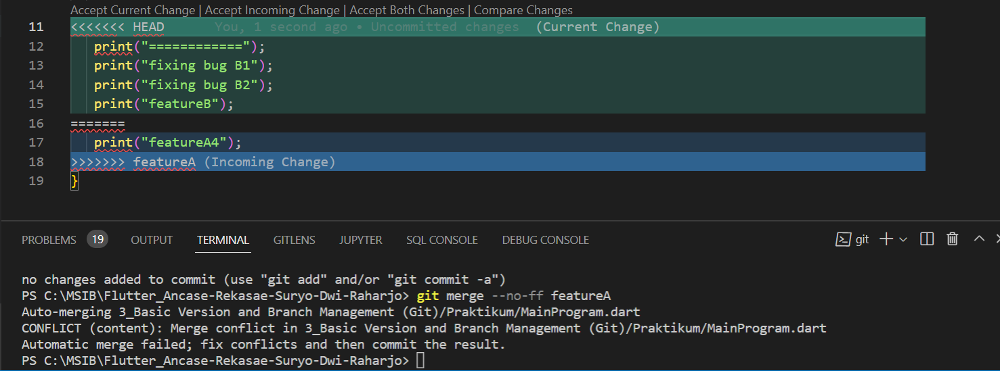
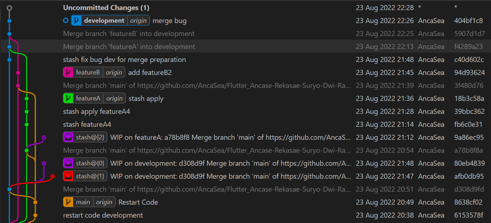

# Section 3 : Basic Version and Branch Management (Git)

## Data Diri

> Nomor Urut  : 1_007fFLC_0  
Nama        : Ancase Rekasae Suryo Dwi Raharjo

--- 

 

## Summary

> Pada Section 3 ini mempelajari Basic Version dan Branch Management menggunakan alat yang bernama **Git**.

Dan ada **5 poin** yang saya tangkap dan pahami, yaitu :
1. Mengatur Versioning dari source code program yang dengan menggunakan **Git**.
2. **Git** mempunyai beberapa area untuk menyimpan versioning agar terstruktur yaitu working directory, staging area, repository.
3. Untuk menghandle versioning, **Git** mempunyai code yang berfungsi sendiri-sendiri untuk menghandle versioning tersebut seperti :  
    a. `git config`  
    b. `git remote`  
    c. `git push`  
    d. `git clone`  
    e. `git init`  
    f. dll
4. Kemudian ada **Branching** yang berguna memudahkan programmer berkolaborasi serta merapikan struktur program, untuk membuat branch nya menggunakan code :   `git branch <"nama branch">`.
5. Terakhir **workflow collaboration** atau cara kerja saat kolaborasi, bertujuan agar jalannya pembuatan projek mulus tanpa kendala. Seperti jangan mengotak-atik master branch karena digunakan hanya untuk merge jika development sudah fix dan hindari direct edit di branch development harus membuat branch lagi khusus fixing bug atau penambahan fitur dll.

---

 

## Task

### Task 1

> Berikut pembuatan repository yang saya buat langsung di Github :

---

### Task 2

> Branching dilakukan dengan menggunakan code
  
`git branch <"nama branch">` 
 
Berikut untuk hasil branch yang sudah dibuat sesuai task :

---

### Task 3

> Dalam menggunakan **Git** untuk melakukan proses handle source code menggunakan beberapa code, yaitu : 

- `git pull origin <"branch">`, berfungsi untuk menarik atau mengambil source dari branch yang diinginkan. Berikut implementasi di terminal :

- `git stash`, berfungsi untuk menyimpan sementara code pada branch yang di remote dan belum di add ke stage. Berikut implementasi di terminal :

- `git merge`, berfungsi untuk menggabungkan dua file yang diinginkan, selain itu ada **dua tipe** merge yaitu :
  - *non fast forward* (--no-ff), akan tetap melacak merge yang dilakukan di branch.
  - *fast forward* (--ff), melebur graph git menjadi satu atau dengan kata lain tidak akan melacak merge yang dilakukan. 
  
  Berikut implementasi di terminal :

- `git push origin <"branch">`, berfungsi untuk memasukkan code yang di modified ke dalam repository yang diremote. Sebelum push harus terlebih dahulu menginputkan di terminal code `git add` yang berfungsi memasukkan code modified ke **staging area**, kemudian input `git commit -m "komentar"` yang berfungsi untuk menaruh komentar push yang akan dilakukan dan terakhir baru bisa di push. Berikut implementasi di terminal :

---

### Task 4

> Pada saat melakukan `git merge` ada salah satu kasus yang nanti akan sering ditemui yaitu conflict merge.

Yang berarti ada code yang saling bertubrukan pada line yang sama yang sedang di merge tersebut. seperti :

Gambar diatas menunjukkan conflict merge dari branch featureB ke featureA. Pada kasus tersebut penanganan conflict nya adalah pilih **Accept Both Change** karena saya ingin keep kedua code yang bertabrakan tersebut lalu merapikannya.

---

### Task 5

> `git merge` mempunyai dua tipe seperti yang dijelaskan di task 3 tadi yaitu *no fast forward* dan *fast forward*.

Berikut implementasi salah satu tipe merge yaitu *no fast forward* di terminal :

---

 

> #### note :
> berikut ini adalah gambar graph dari perintah-perintah git yang dilacak oleh git graph :
> 