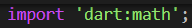

# Section 5 : Introduction to Algorithm and Dart Programming

## Data Diri

> Nomor Urut  : 1_007fFLC_0  
Nama        : Ancase Rekasae Suryo Dwi Raharjo

--- 

 

## Task

>Pada section 5 ini diberikan dua task yang berkaitan dengan Algorithm and Dart Programming, diantaranya adalah :

### Task 1 : Implementasi rumus lingkaran pada program Dart

>Di task 1 ini saya mengerjakan kode program untuk menghitung Luas Lingkaran dengan generate angka random dan proses perhitungan saya bedakan.

Pertama saya melakukan import 'dart:math', yang bertujuan untuk memanggil function generate angka random.

Kedua membuat fungsi main untuk menjalankan dan menampilkan kode-kode program proses perhitungan Luas Lingkaran dengan memanggil fungsi langsung dan diisi parameternya, seperti berikut :

Kemudian membuat fungsi LuasLingkaran dengan tipe data void dan parameter untuk memasukkan nilai jari-jari. Setelah itu di proses pada variabel `hitungLuas` lalu di return untuk menghasilkan nilai, seperti berikut :

Terakhir hasil output yang akan dihasilkan seperti berikut :

### Task 2 : Buat 3 buah variabel yang berisi string, lalu sambungkan seluruh string tersebut, dan tampilkan pada layar

>Task 2 saya membuat 3 variabel `String` seperti yang diperintahkan pada soal. Variabel tersebut berisi nama saya yang dibagi menjadi 3 bagian.

Pertama seperti biasa membuat fungsi top level dart yaitu fungsi main dan didalamnya ada 3 variabel `String` berisi penggalan nama saya dari `firstName`, `middelName`, dan `LastName`.

Kemudian dalam fungsi main tersebut penampilan output digunakan format kode yang cukup simpel untuk penggabungan `String` yang seperti diinginkan dan pemanggilan variabel-variabel nya yang simpel. Berikut untuk hasil outputnya :

---
