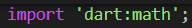
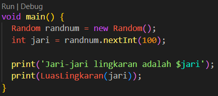
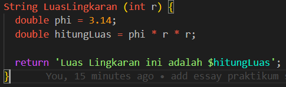
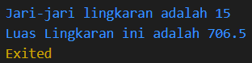
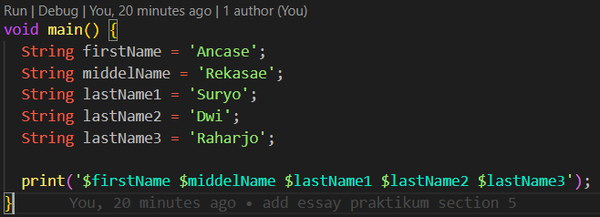

# Section 6 : Basic Dart Programming

## Data Diri

> Nomor Urut  : 1_007fFLC_0  
Nama        : Ancase Rekasae Suryo Dwi Raharjo

--- 

 

## Task

>Pada section 6 ini ada dua task yang diberikan untuk, diantaranya adalah :

### Task 1 : Implementasi rumus lingkaran pada program Dart

>Di task 1 ini saya mengerjakan kode program untuk menghitung Luas Lingkaran dengan generate angka random dan proses perhitungan saya bedakan.

Pertama saya melakukan import 'dart:math', yang bertujuan untuk memanggil function generate angka random.

Kedua membuat fungsi main untuk menjalankan dan menampilkan kode-kode program proses perhitungan Luas Lingkaran dengan output fungsi LuasLingkaran didalam perintah print, seperti berikut :

Kemudian membuat fungsi LuasLingkaran dengan tipe data `String` dan parameter untuk memasukkan nilai jari-jari. Setelah itu di proses pada variabel `hitungLuas` dan tinggal direturn variabel `hitungLuas` nya, seperti berikut :

Terakhir hasil output yang akan dihasilkan seperti berikut :

### Task 2 : Buat 3 buah variabel yang berisi string, lalu sambungkan seluruh string tersebut, dan tampilkan pada layar

>Pada task 2 diperintahkan membuat 3 variabel `String`, tapi disini saya membuat 5 variabel `String`. Variabel tersebut berisi nama saya yang dibagi menjadi 5 bagian.

Pertama seperti biasa membuat fungsi top level dart yaitu fungsi main dan didalamnya ada 5 variabel `String` berisi penggalan nama saya dari `firstName`, `middelName`, dan `LastName1`, `LastName2`, `LastName3`.

Kemudian dalam fungsi main tersebut penampilan output digunakan format kode yang cukup simpel untuk penggabungan `String` yang seperti diinginkan dan pemanggilan variabel-variabel nya yang simpel. Berikut untuk hasil outputnya :

---
