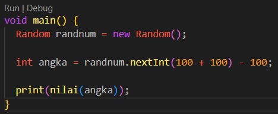

# Section 7 : ranching - Looping - Function

## Data Diri

> Nomor Urut  : 1_007fFLC_0  
Nama        : Ancase Rekasae Suryo Dwi Raharjo

--- 

 

## Task

### Task 1

>Buat fungsi yang terdapat sebuah nilai :  
a. jika nilai > 70 : return A  
b. jika nilai >40 : return B  
c. jika nilai > 0 : return C  
d. selain itu return teks kosong

Pada task 1 ini saya membuat konsep dalam pengambilan keputusan atau 
kondisi tersebut akan berdasarkan variabel nilai yang berupa angka 
secara random dari negatif 100 sampai 100.

Berikut adalah penulisan code yang saya kerjakan :

1. Pertama memgimport dart math untuk generate angka random

2. Kedua membuat fungsi untuk proses pengambilan keputusan

3. Ketiga mendeklarasikan variabel random angka dan variabel untuk 
   menginisiasikan batas max dan min angka ke fungsi proses pengambilan 
   keputusan

### Task 2

>Tampilkan nilai faktorial dari :  
a. 10  
b. 20  
c. 30

Pada Task 2 pengerjaan saya menggunakan fungsi lain juga input parameter
untuk proses faktorisasi yang lebih simpel dan tidak menulis code proses 
faktorisasi berulang kali.

Berikut penulisan code yang saya buat :

1. Pertama membuat fungsi void hitungFaktorisasi dengan parameter int

   

    Di dalam fungsi hitungFaktorisasi terdapat variabel double yang berguna 
    untuk pengalian faktorisasi nilai yang diinputkan dan juga menyimpan 
    sementara hasil pengalian sampai dengan mendekati maksimal angka yang 
    diinputkan.
        Kemudian untuk proses pengalian faktorisasi menggunakan perulangan 
    For yang menggunakan variabel `i` untuk inisiasi awal, batas max perulangan,
    dan increment nilai. Dan didalamnya ada perkalian variabel faktorial 
    dan `i`. Terakhir tinggal menampilkan hasil faktorisasi.

2. Kedua void main dengan isi memanggil fungsi hitungFaktorisasi dan mengisi
   parameter tiga kali seperti pada soal

   