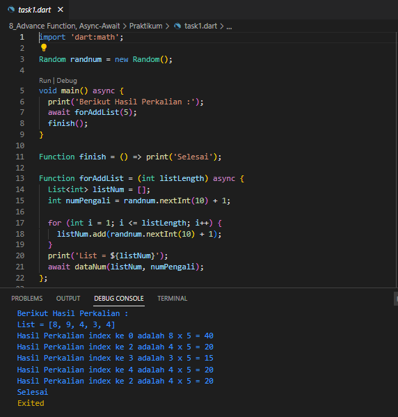
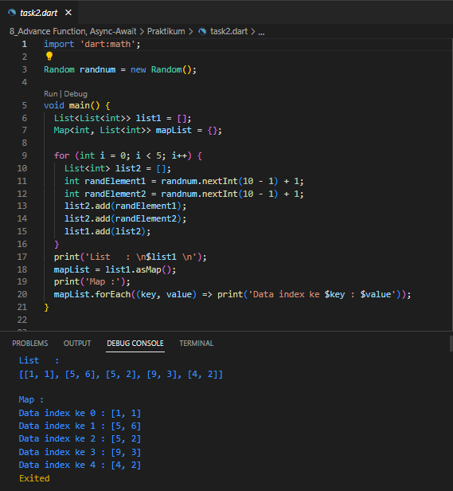

1. Buatlah sebuah fungsi dengan spesifikasi berikut:  
a. menerima 2 parameter, yaitu list data dan pengali.  
b. lakukan perulangan pada list data secara asynchronous. 
c. tiap perulangan, kalikan element list data dengan pengali.  
d. return list baru yang berisi hasil proses diatas. 

2. Buatlah sebuah list dengan spesifikasi berikut:  
a. tiap element-nya berupa list juga,  
b. tiap element wajib terdapat 2 data (sub-element).  
Buatlah sebuah Map dengan menggunakan list tersebut!  

