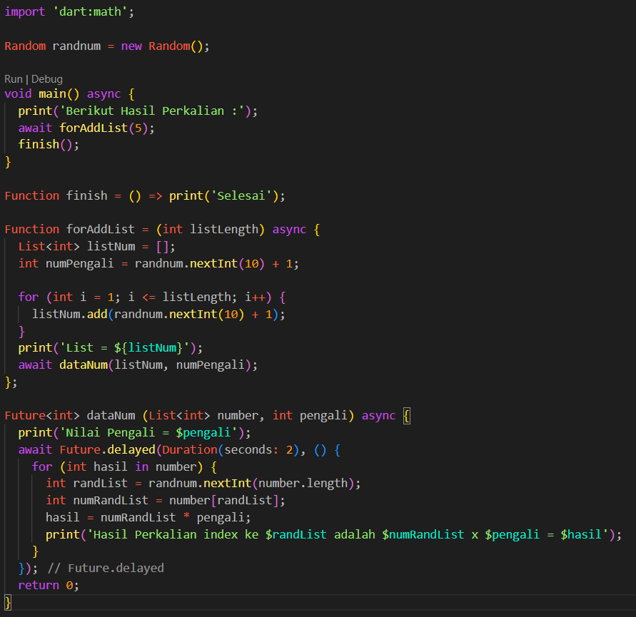
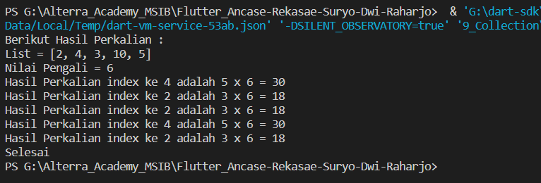
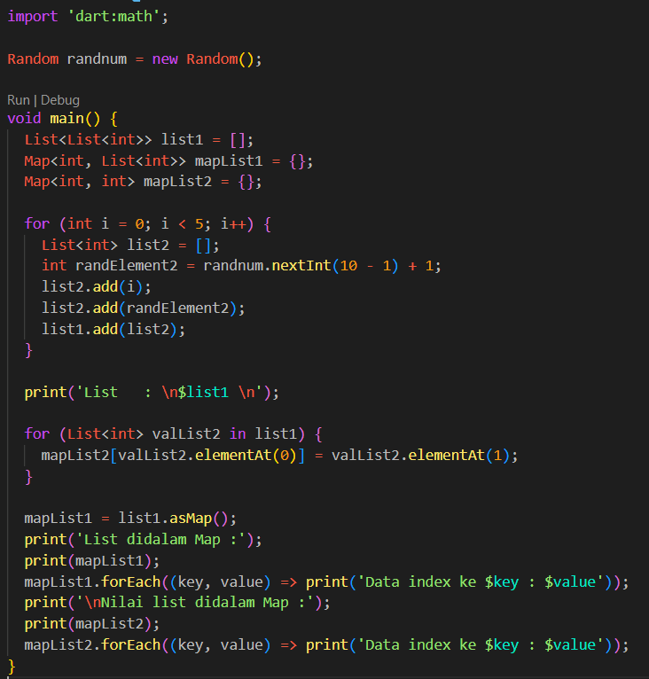
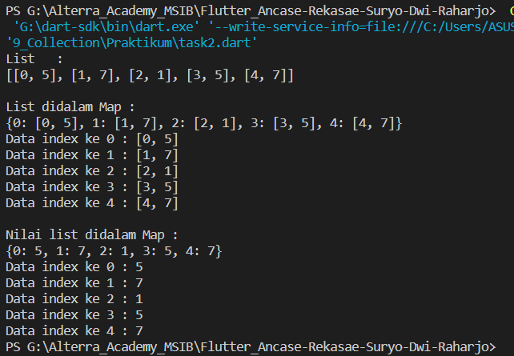

# Section 9 : Collection

## Data Diri

> Nomor Urut  : 1_007fFLC_0  
Nama        : Ancase Rekasae Suryo Dwi Raharjo

--- 

 

## Task

### Task 1

>Buatlah sebuah fungsi dengan spesifikasi berikut:  
a. menerima 2 parameter, yaitu list data dan pengali.  
b. lakukan perulangan pada list data secara asynchronous. 
c. tiap perulangan, kalikan element list data dengan pengali.  
d. return list baru yang berisi hasil proses diatas. 

Pada task 1 ini saya membuat konsep dalam pengambilan nilai di list dan nilai pengali menggunakan angka random 1 sampai 10 dari `dart:Math`

    Berikut adalah penulisan code yang saya kerjakan :

Screenshot code diatas menunjukkan 3 fungsi yang dibuat untuk keperluan memenuhi permintaan soal yang saya pahami.
1. Pertama, arrow function finish dibuat untuk mengecek apakah async-await bekerja dengan benar di code program.
2. Kedua, anonymous function yang berfungsi untuk proses memasukkan data ke dalam list secara async.
3. Ketiga, Future function disini adalah code inti untuk proses perkalian perulangannya data list dengan nilai pengali secara async-await dan diberi delay 2 detik.

Berikut hasil run code diatas :

### Task 2

>Buatlah sebuah list dengan spesifikasi berikut:  
a. tiap element-nya berupa list juga,  
b. tiap element wajib terdapat 2 data (sub-element).  
Buatlah sebuah Map dengan menggunakan list tersebut!  

Pada Task 2 pengerjaan saya menggunakan angka random untuk nilai list yang nanti nya kan dimasukkan di dalam list lagi. Kemudian nilai list tersebut dan list saya buat dua output map berisi list dan map yang index serta value dari nilai list.

    Berikut adalah penulisan code yang saya kerjakan :

Dari code program diatas ada dua buah perulangan yang mempunyai fungsi nya masing-masing, yaitu 
1. Perulangan pertama berfungsi untuk menginisiasi list2 dan mengisi nilai random ke list2 dan di add ke list1
2. Perulangan kedua berfungsi untuk mengambil list2 dari list1 satu per satu dan memasukkan nya ke dalam map

Kemudian untuk output dua map yang berbeda isi ada pada perulangan kedua dan code `mapList1 = list1.asMap();`, syntax `.asMap()` adalah syntax untuk mengkonversi suatu variabel ke dalam sebuah bentuk Map. Bisa dilihat pada hasil berikut :

---
